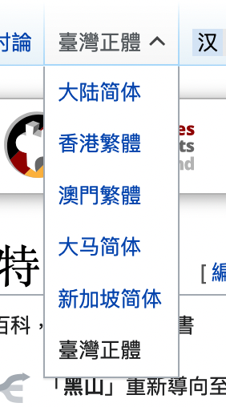
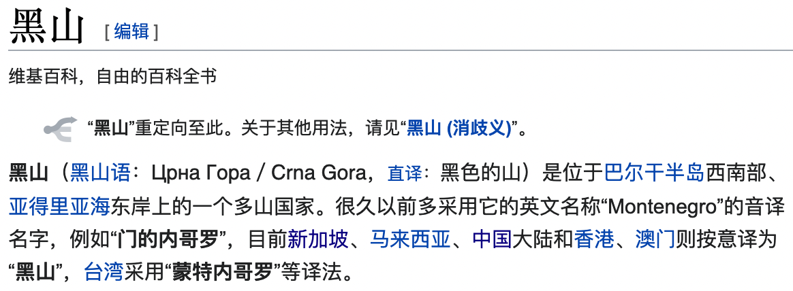
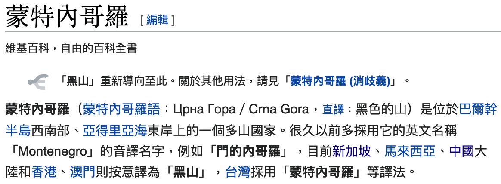

<!-- README.md is generated from README.Rmd. Please edit that file -->

# Regular expressions to match country names in Chinese

<!-- badges: start -->
<!-- badges: end -->

## Challenges

Coming up with regular expressions to match country names in Chinese is
slightly more involved than for other languages. The reason is that
different parts of the world use different variants of Chinese, beyond
the basic distinction between simplified and traditional characters.
Mainland China, Malaysia and Singapore all use simplified characters
whereas Hong Kong, Macau and Taiwan continue to use traditional
characters – but local usage may vary within each group.

This is especially true for proper names like country names. Not only
can they vary character by character depending on the script that is
used, but they might also reflect different (phonetic) transliterations
or refer to another name altogether. Here are some examples for each
case:

1.  **Different scripts.** Germany is referred to as *Deguo* 德国 in
    Mainland China and 德國 in Taiwan – where 国 is the simplified
    character corresponding to 國, easy. However, there are some less
    obvious cases, as we will see below.
2.  **Different transliterations**. Many country names have been
    phonetically adapted from other languages and translators in every
    Chinese-speaking region have taken their artistic liberties when
    doing so. For example, Hong Kongers refer to Barbados as *Babaduosi*
    巴巴多斯 whereas people from Taiwan call it *Babeiduo* 巴貝多.
3.  **Alternative names**. Instead of adapting a country name according
    to its sound, Chinese-speaking people in some regions have also
    opted to convert the original meaning of the country name into
    Chinese. For example, Montenegro is *Heishan* 黑山 (“black
    mountain”) in Mainland China. People on Taiwan, on the other hand,
    kept their phonetic transliteration *Mengteneigeluo* 蒙特內哥羅.

## Proposed solution

The issue of different scripts could be solved in two ways: either by
harmonizing the scripts with some automatic conversion procedure or
writing complex regular expressions that match any script. I discuss the
two approaches below in the section on testing my regular expressions
and focus on the second issue here.

The issues of different transliterations and alternative country names
call for the same solution: coming up with a list of country names from
each Chinese-speaking region. The regular expressions need to be able to
match each element of these lists. Luckily, Wikipedia not only records
the official country name, the colloquial country name as well as name
variants; it does so for flavors of Chinese from Mainland China, Hong
Kong, Macau, Malaysia, Singapore and Taiwan.



Wikipedia even offers an [overview
page](https://zh.wikipedia.org/zh-cn/世界政區索引) with full and short
country names. This page alone is not sufficient for two reasons. First,
it does not include any name variants; second, it contains errors
(Ghana’s full name is written using the traditional character 迦 while
the short name contains the simplified 加).

But since the overview page provides links to the individual country
pages, it can serve as an entry point for web crawling. On each page,
Wikipedia’s localization not only takes care of character-by-character
conversion but also reflects differences in usage described above, as
the following example of Montenegro shows:





## Procedure

1.  Scrape country names from each country page (in each language
    variant). I use the article heading as the short name, the first
    name in the first sentence as the official name, and all other names
    in the first sentence (typeset in bold) as name variants.
2.  Convert all country names to simplified characters and identify the
    longest common substring. This substring serves as a basis for
    developing regular expressions manually. If a substring entirely
    matches one of the country name, I use it as the regular expression
    and overwrite it only in case of ambiguity (e.g., Congo 刚果).
3.  Manually develop regular expressions including lookarounds to
    distinguish the various Guineas and similar cases from each other.
    Out of the variants in my list, I only ignore transliterations from
    the local language (e.g., *Aoteyaluowa* 奥特亚罗瓦 for New Zealand)
    and the ones that are obviously outdated (such as *Bulukeba*
    布魯克巴, apparently used for Bhutan during the Qing dynasty). The
    resulting regular expressions should be fairly specific but still
    assume that the input is a country name of some sort. Otherwise, the
    regular expression for Western Sahara
    (`西撒哈拉|撒哈?拉.*民主共和国`) might also match the geographical
    term for the western part of the Sahara desert, and so on.
4.  Merge ISO3 codes and regular expressions to the conversion table
    comprising short and full names in all language variants.
5.  Test the regular expressions against all variants (in simplified
    Chinese) below.

## File and variable descriptions

### Files

All output files are saved in `data/`. The one that includes regular
expressions and can be used as a conversion table is `dict.csv`.

-   `countrynames.csv`: Short name, full (official) name and name
    variants for each language variant
-   `dict.csv`: Only short and full (official) name for each language
    variant but including ISO3 codes and regular expressions.
-   `overview.csv`: Links to country-specific Wikipedia pages.

### Language variant codes

| Code  | Description (Chinese) | Description (English)   |
|:------|:----------------------|:------------------------|
| zh_cn | 大陆简体              | Mainland (simplified)   |
| zh_hk | 香港繁體              | Hong Kong (traditional) |
| zh_mo | 澳門繁體              | Macau (traditional)     |
| zh_my | 大马简体              | Malaysia (simplified)   |
| zh_sg | 新加坡简体            | Singapore (simplified)  |
| zh_tw | 臺灣正體              | Taiwan (traditional)    |

## Making regexes work for traditional Chinese

As stated above, there are broadly to ways of making my regular
expressions (in simplified Chinese) work for variants using traditional
Chinese: first, a two-step approach that converts the input into
simplified Chinese and then matches the regular expressions; and second,
expanding the regular expressions themselves to capture any character
variants.

Although the two-step approach has some caveats, I prefer it over the
second one. The reason for my preference comes down to better
maintenance. The simplified regular expressions already contain case
distinctions (e.g., `西班牙|(日斯|以西)(巴|把)(尼|你)亚`). By adding
character variants by hand, the expressions would quickly become
convoluted, making it hard to keep track of all six variants. Another
question is feasibility: depending on your font, you might not even spot
all character variants unless you employ some testing routines:

``` r
# different unicode character, invisible depending on font
identical("阿布哈茲","阿布哈兹")
#> [1] FALSE
```

With the two-step approach, maintenance is easy because it requires only
one set of regular expressions. The drawbacks of this approach are
two-fold. First, either the users have to take care of the conversion
themselves or the conversion package (such as
[OpenCC](https://github.com/BYVoid/OpenCC)) needs be added as a
dependency to the function. Second, the conversion between character
variants is not a one-to-one mapping. This is obviously true for the
conversion from traditional to simplified characters but holds even in
the opposite direction. However, to my knowledge there are only few
cases in which a traditional character corresponds to multiple
simplified ones[^1]

Therefore, first converting to simplified (with the same engine that I
used to create the regexes) is prefered.

[^1]: 乾隆帝
